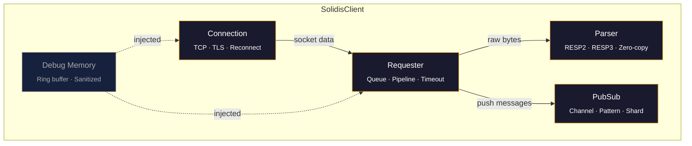
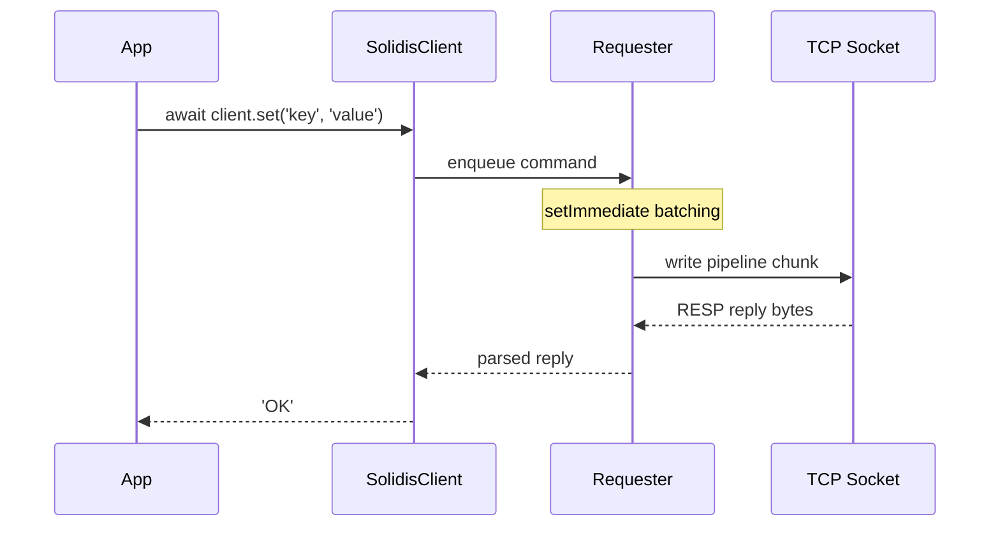

<h1 align="center"></h1>

<p align="center">
  <b>Zero-dependency RESP client for Redis. Fastest by design.</b>
</p>

<p align="center">
  <a href="https://www.npmjs.com/package/@vcms-io/solidis"></a>
  <a href="https://github.com/vcms-io/solidis"></a>
  <a href="https://github.com/vcms-io/solidis"></a>
  <a href="https://github.com/vcms-io/solidis"></a>
  <a href="https://github.com/vcms-io/solidis"></a>
  <a href="https://github.com/vcms-io/solidis"></a>
</p>

<p align="center">
  <a href="#빠른-시작">빠른 시작</a>&nbsp;&nbsp;·&nbsp;&nbsp;<a href="#기능">기능</a>&nbsp;&nbsp;·&nbsp;&nbsp;<a href="#설정">설정</a>&nbsp;&nbsp;·&nbsp;&nbsp;<a href="#아키텍처">아키텍처</a>&nbsp;&nbsp;·&nbsp;&nbsp;<a href="#확장">확장</a>&nbsp;&nbsp;·&nbsp;&nbsp;<a href="./README.md">English</a>
</p>

<br/>

<p align="center">
  
</p>

<table align="center">
<tr>
<td align="center"><br/><strong>0 deps</strong><br/><sub>제로 의존성</sub></td>
<td align="center"><br/><strong>383</strong><br/><sub>커맨드</sub></td>
<td align="center"><br/><strong>19K+</strong><br/><sub>테스트 라인</sub></td>
<td align="center"><br/><strong>&lt; 29KB</strong><br/><sub>최소 번들</sub></td>
</tr>
</table>

<br/>

## 빠른 시작

```bash
npm install @vcms-io/solidis
```

```typescript
import { SolidisFeaturedClient } from '@vcms-io/solidis/featured';

const client = new SolidisFeaturedClient({ host: '127.0.0.1', port: 6379 });

await client.set('key', 'value');
const value = await client.get('key');
```

> [!TIP]
> **번들 크기가 중요하다면?** `SolidisClient` + `.extend()`로 쓰는 커맨드만 가져오세요.
> 트리 쉐이킹 적용 시 **< 29KB**까지 줄일 수 있습니다.

<details>
<summary>&nbsp;&nbsp;<b>트리 쉐이킹 클라이언트</b></summary>

<br/>

```typescript
import { SolidisClient } from '@vcms-io/solidis';
import { get } from '@vcms-io/solidis/command/get';
import { set } from '@vcms-io/solidis/command/set';

import type { SolidisClientExtensions } from '@vcms-io/solidis';

const extensions = { get, set } satisfies SolidisClientExtensions;
const client = new SolidisClient({ host: '127.0.0.1', port: 6379 }).extend(extensions);
```

</details>

<details>
<summary>&nbsp;&nbsp;<b>트랜잭션 & 파이프라인</b></summary>

<br/>

```typescript
// 트랜잭션 (MULTI/EXEC)
const tx = client.multi();
tx.set('key', 'value');
tx.incr('counter');
const results = await tx.exec();

// 파이프라인 (raw)
const results = await client.send([
  ['set', 'a', '1'],
  ['incr', 'counter'],
  ['get', 'a']
]);
```

</details>

<details>
<summary>&nbsp;&nbsp;<b>Pub/Sub</b></summary>

<br/>

```typescript
client.on('message', (channel, message) => {
  console.log(`${channel}: ${message}`);
});
await client.subscribe('events');
```

</details>

<br/>

<div id="benchmark">

##  벤치마크

<div align="center">

#  Solidis vs ioredis 

<small>측정일 2026-06-20 10:16:24 · linux x64 · Node.js v22.22.3</small>
### ioredis 대비 최대 **2.1x 빠릅니다**! 

---
<br/>

**15**개 중 **15**개 벤치마크 우위 · 평균 **73%** 성능 향상 · 최대 **113%** 성능 향상

*100,000번 반복 × 10,000 동시 실행 · 1 KB 페이로드 · 10회 측정*

| | 벤치마크 | 명령어 | solidis | ioredis | 차이 | 성능 |
|---:|:---|:---:|:---:|:---:|:---:|:---|
|  | **Set 변경** | <sup><sub><kbd>SADD</kbd> <kbd>SISMEMBER</kbd> <kbd>SREM</kbd></sub></sup> | **1535ms** | 3267ms | **2.1x**  | `██████████` |
|  | **List 범위** | <sup><sub><kbd>LPUSH</kbd> <kbd>RPUSH</kbd> <kbd>LRANGE</kbd></sub></sup> | **1934ms** | 3626ms | **1.9x**  | `████████░░` |
|  | **Multi-Key** | <sup><sub><kbd>MSET</kbd> <kbd>MGET</kbd></sub></sup> | **1669ms** | 3108ms | **1.9x**  | `████████░░` |
| 4. | **Set** | <sup><sub><kbd>SET</kbd></sub></sup> | **719ms** | 1316ms | **1.8x**  | `███████░░░` |
| 5. | **Set 조회** | <sup><sub><kbd>SADD</kbd> <kbd>SISMEMBER</kbd> <kbd>SMEMBERS</kbd></sub></sup> | **1789ms** | 3190ms | **1.8x**  | `███████░░░` |
| 6. | **Hash 변경** | <sup><sub><kbd>HMSET</kbd> <kbd>HMGET</kbd> <kbd>HDEL</kbd></sub></sup> | **1893ms** | 3374ms | **1.8x**  | `███████░░░` |
| 7. | **List 변경** | <sup><sub><kbd>LPUSH</kbd> <kbd>RPUSH</kbd> <kbd>LPOP</kbd> <kbd>RPOP</kbd> <kbd>LLEN</kbd></sub></sup> | **2557ms** | 4491ms | **1.8x**  | `███████░░░` |
| 8. | **Sorted Set** | <sup><sub><kbd>ZADD</kbd> <kbd>ZRANGE</kbd> <kbd>ZREM</kbd></sub></sup> | **1929ms** | 3388ms | **1.8x**  | `███████░░░` |
| 9. | **비트랜잭션** | <sup><sub><kbd>SETPX</kbd> <kbd>GET</kbd></sub></sup> | **1224ms** | 2090ms | **1.7x**  | `██████░░░░` |
| 10. | **Stream** | <sup><sub><kbd>XADD</kbd> <kbd>XRANGE</kbd> <kbd>XLEN</kbd></sub></sup> | **1869ms** | 3164ms | **1.7x**  | `██████░░░░` |
| 11. | **Expire** | <sup><sub><kbd>SET</kbd> <kbd>EXPIRE</kbd> <kbd>TTL</kbd></sub></sup> | **1486ms** | 2483ms | **1.7x**  | `██████░░░░` |
| 12. | **파이프라인 혼합** | <sup><sub><kbd>SET</kbd> <kbd>INCR</kbd> <kbd>GET</kbd></sub></sup> | **1553ms** | 2474ms | **1.6x**  | `█████░░░░░` |
| 13. | **Counter** | <sup><sub><kbd>INCR</kbd> <kbd>DECR</kbd></sub></sup> | **892ms** | 1376ms | **1.5x**  | `█████░░░░░` |
| 14. | **Hash 왕복** | <sup><sub><kbd>HSET</kbd> <kbd>HGET</kbd> <kbd>HGETALL</kbd></sub></sup> | **1609ms** | 2402ms | **1.5x**  | `████░░░░░░` |
| 15. | **Get Buffer** | <sup><sub><kbd>GETBUFFER</kbd></sub></sup> | **627ms** | 931ms | **1.5x**  | `████░░░░░░` |

### 엄격 비교가 불가능한 벤치마크

<sub>라이브러리별 고유 동작으로 인해 엄밀한 비교가 어려운 벤치마크입니다.</sub>

| | 벤치마크 | 명령어 | solidis | ioredis | 차이 | 성능 |
|---:|:---|:---:|:---:|:---:|:---:|:---|
| 16. | **트랜잭션** | <sup><sub><kbd>SET</kbd> <kbd>EXPIRE</kbd> <kbd>GET</kbd></sub></sup> | 1284ms | 6331ms | **4.9x**  | `██████████` |
| 17. | **트랜잭션 혼합** | <sup><sub><kbd>SET</kbd> <kbd>GET</kbd></sub></sup> | 1637ms | 6134ms | **3.7x**  | `██████████` |
| 18. | **Pub/Sub** | <sup><sub><kbd>PUBLISH</kbd> <kbd>MESSAGE</kbd></sub></sup> | 737ms | 2523ms | **3.4x**  | `██████████` |
| 19. | **Info / Config** | <sup><sub><kbd>INFO</kbd> <kbd>CONFIGGET</kbd></sub></sup> | 1109ms | 2039ms | **1.8x**  | `███████░░░` |

<sub>`solidis`의 `ioredis` (기준) 대비 성능 향상률 순으로 정렬. 소요 시간 = 반복 측정의 중앙값.</sub>

</div>

<br/>

##  상세 지표

<sub>라이브러리별 전체 지표: 초당 작업 수, 초당 명령 수, 소요 시간 중앙값, 분산 (변동 계수).</sub>

<details>
<summary>상세 지표 테이블 펼치기</summary>

| 벤치마크 | 라이브러리 | ops/s | cmds/s | 소요 시간 | 분산 |
|:---|:---|---:|---:|---:|---:|
| **Set 변경: <sup><sub><kbd>SADD</kbd> <kbd>SISMEMBER</kbd> <kbd>SREM</kbd></sub></sup>**<br/><sub>1 KB</sub> | **solidis** | 65.2K | 195.5K | 1535ms | ±8.8% |
|  | ioredis | 30.6K | 91.8K | 3267ms | ±1.1% |
| **List 범위: <sup><sub><kbd>LPUSH</kbd> <kbd>RPUSH</kbd> <kbd>LRANGE</kbd></sub></sup>**<br/><sub>1 KB</sub> | **solidis** | 51.7K | 155.1K | 1934ms | ±8.9% |
|  | ioredis | 27.6K | 82.7K | 3626ms | ±0.8% |
| **Multi-Key: <sup><sub><kbd>MSET</kbd> <kbd>MGET</kbd></sub></sup>**<br/><sub>1 KB</sub> | **solidis** | 59.9K | 119.8K | 1669ms | ±6.8% |
|  | ioredis | 32.2K | 64.4K | 3108ms | ±4.3% |
| **Set: <sup><sub><kbd>SET</kbd></sub></sup>**<br/><sub>1 KB</sub> | **solidis** | 139.0K | 139.0K | 719ms | ±8.9% |
|  | ioredis | 76.0K | 76.0K | 1316ms | ±1.1% |
| **Set 조회: <sup><sub><kbd>SADD</kbd> <kbd>SISMEMBER</kbd> <kbd>SMEMBERS</kbd></sub></sup>**<br/><sub>1 KB</sub> | **solidis** | 55.9K | 167.7K | 1789ms | ±2.5% |
|  | ioredis | 31.3K | 94.0K | 3190ms | ±2.7% |
| **Hash 변경: <sup><sub><kbd>HMSET</kbd> <kbd>HMGET</kbd> <kbd>HDEL</kbd></sub></sup>**<br/><sub>1 KB</sub> | **solidis** | 52.8K | 158.5K | 1893ms | ±4.1% |
|  | ioredis | 29.6K | 88.9K | 3374ms | ±1.1% |
| **List 변경: <sup><sub><kbd>LPUSH</kbd> <kbd>RPUSH</kbd> <kbd>LPOP</kbd> <kbd>RPOP</kbd> <kbd>LLEN</kbd></sub></sup>**<br/><sub>1 KB</sub> | **solidis** | 39.1K | 195.6K | 2557ms | ±2.4% |
|  | ioredis | 22.3K | 111.3K | 4491ms | ±4.2% |
| **Sorted Set: <sup><sub><kbd>ZADD</kbd> <kbd>ZRANGE</kbd> <kbd>ZREM</kbd></sub></sup>**<br/><sub>1 KB</sub> | **solidis** | 51.8K | 155.5K | 1929ms | ±3.2% |
|  | ioredis | 29.5K | 88.6K | 3388ms | ±0.9% |
| **비트랜잭션: <sup><sub><kbd>SETPX</kbd> <kbd>GET</kbd></sub></sup>**<br/><sub>1 KB</sub> | **solidis** | 81.7K | 163.5K | 1224ms | ±4.0% |
|  | ioredis | 47.8K | 95.7K | 2090ms | ±1.0% |
| **Stream: <sup><sub><kbd>XADD</kbd> <kbd>XRANGE</kbd> <kbd>XLEN</kbd></sub></sup>**<br/><sub>1 KB</sub> | **solidis** | 53.5K | 160.5K | 1869ms | ±4.4% |
|  | ioredis | 31.6K | 94.8K | 3164ms | ±2.1% |
| **Expire: <sup><sub><kbd>SET</kbd> <kbd>EXPIRE</kbd> <kbd>TTL</kbd></sub></sup>**<br/><sub>1 KB</sub> | **solidis** | 67.3K | 201.9K | 1486ms | ±9.0% |
|  | ioredis | 40.3K | 120.8K | 2483ms | ±1.0% |
| **파이프라인 혼합: <sup><sub><kbd>SET</kbd> <kbd>INCR</kbd> <kbd>GET</kbd></sub></sup>**<br/><sub>1 KB</sub> | **solidis** | 64.4K | 193.2K | 1553ms | ±6.0% |
|  | ioredis | 40.4K | 121.3K | 2474ms | ±2.3% |
| **Counter: <sup><sub><kbd>INCR</kbd> <kbd>DECR</kbd></sub></sup>**<br/><sub>1 KB</sub> | **solidis** | 112.1K | 224.2K | 892ms | ±7.2% |
|  | ioredis | 72.7K | 145.3K | 1376ms | ±1.5% |
| **Hash 왕복: <sup><sub><kbd>HSET</kbd> <kbd>HGET</kbd> <kbd>HGETALL</kbd></sub></sup>**<br/><sub>1 KB</sub> | **solidis** | 62.1K | 186.4K | 1609ms | ±3.9% |
|  | ioredis | 41.6K | 124.9K | 2402ms | ±2.3% |
| **Get Buffer: <sup><sub><kbd>GETBUFFER</kbd></sub></sup>**<br/><sub>1 KB</sub> | **solidis** | 159.6K | 159.6K | 627ms | ±3.3% |
|  | ioredis | 107.4K | 107.4K | 931ms | ±1.6% |

</details>

---

##  설정

<details>
<summary>벤치마크 설정 펼치기</summary>

| 항목 | 값 |
|:----------|:------|
| 모드 | `autopipeline` |
| 페이로드 크기 | 1 KB |
| 반복 횟수 | 100,000 |
| 워밍업 | 1,000 |
| 클라이언트 수 | 1 |
| 클라이언트당 동시 실행 | 10000 |
| 총 동시 실행 | 10000 |
| 측정 횟수 | 10 |
| 쿨다운 | 2500ms |
| 플랫폼 | linux x64 |
| Node.js | v22.22.3 |
| 날짜 | 2026-06-20 10:16:24 |

</details>

---

##  측정 방법론

- 각 벤치마크는 GC 및 JIT 간섭을 방지하기 위해 **격리된 워커 스레드**에서 실행됩니다
- 순서 편향을 줄이기 위해 반복 측정 시 라이브러리를 **번갈아 실행**합니다
- Redis 서버는 각 벤치마크 케이스 사이에 **초기화 및 안정화**됩니다
- 페이로드는 두 라이브러리가 공유하는 **결정론적 의사 난수 풀**을 사용합니다
- 소요 시간은 전체 반복 샘플의 **중앙값**입니다
- 분산은 **변동 계수** (σ / 중앙값 × 100%)입니다

</div>

## 기능

<table>
<tr>
<td width="50%" valign="top">

###  성능

- `setImmediate` 기반 파이프라인 자동 병합
- Zero-copy RESP 파서 (버퍼 슬라이스 재사용)
- 백프레셔 대응 청크 단위 소켓 쓰기
- 이벤트 루프 양보 포인트 설정 가능

</td>
<td width="50%" valign="top">

###  프로토콜

- RESP2 + RESP3 와이어 레벨 풀 구현
- 17가지 RESP3 데이터 타입 전부 지원 (Map, Set, Push, BigNumber, ...)
- unsafe integer 자동 BigInt 변환
- 바이너리 세이프, 멀티바이트 문자 정상 처리

</td>
</tr>
<tr>
<td width="50%" valign="top">

###  안정성

- 자동 재연결 (configurable backoff)
- 재연결 시 SELECT, Pub/Sub 구독 자동 복구
- 파이프라인 단위 커맨드 타임아웃
- Ready check로 서버 로딩 완료까지 대기
- 장애 발생 시 in-flight 요청 즉시 reject

</td>
<td width="50%" valign="top">

###  보안

- TLS/SSL 지원 (`rediss://` 또는 `tls` 옵션)
- ACL 인증 (username/password)
- 디버그 로그에서 자격 증명 자동 마스킹
- `maxBulkStringLength`로 비정상 응답 차단

</td>
</tr>
<tr>
<td width="50%" valign="top">

###  타입 안전성

- TypeScript `strict` 모드, 커맨드별 I/O 타입 정의
- 런타임 응답 가드 (`tryReplyToString`, ...)
- 구조화된 에러 계층 + cause chain

</td>
<td width="50%" valign="top">

###  확장성

- `.extend()`로 커맨드 조합 (트리 쉐이킹 가능)
- 커스텀 커맨드에서 클라이언트 `this` 접근
- MULTI/EXEC 프록시에서 금지 메서드 자동 차단

</td>
</tr>
</table>

## 설정

<details>
<summary><b>전체 옵션 레퍼런스</b></summary>

```typescript
const client = new SolidisClient({
  // 연결
  uri: 'redis://localhost:6379',
  host: '127.0.0.1',
  port: 6379,
  tls: { /* tls.ConnectionOptions */ },
  lazyConnect: false,

  // 인증
  authentication: { username: 'user', password: 'pass' },
  database: 0,

  // 프로토콜 / 복구
  clientName: 'solidis',
  protocol: 'RESP2',                      // 'RESP2' | 'RESP3'
  autoReconnect: true,
  enableReadyCheck: true,
  maxReadyCheckRetries: 100,
  readyCheckInterval: 100,
  maxConnectionRetries: 20,
  connectionRetryDelay: 100,
  autoRecovery: {
    database: true,
    subscribe: true,
    ssubscribe: true,
    psubscribe: true,
  },

  // 타임아웃 (ms)
  commandTimeout: 5000,
  connectionTimeout: 2000,
  socketWriteTimeout: 1000,

  // 성능 튜닝
  maxCommandsPerPipeline: 300,
  maxProcessRepliesPerChunk: 4096,
  maxProcessReplyBytesPerChunk: 8_388_608,  // 8MB
  maxSocketWriteSizePerOnce: 65_536,        // 64KB
  rejectOnPartialPipelineError: false,

  // 파서
  parser: {
    buffer: { initial: 4_194_304, shiftThreshold: 2_097_152 },
    maxBulkStringLength: 536_870_912,       // 512MB
  },

  // 기타
  maxEventListenersForClient: 10_240,
  maxEventListenersForSocket: 10_240,
  debug: false,
  debugMaxEntries: 10_240,
});
```

</details>

## 아키텍처





| 모듈 | 역할 |
|:-------|:---------------|
| **Connection** | TCP/TLS 소켓 관리, 재연결 백오프 |
| **Requester** | 커맨드 큐, 파이프라인 청킹, 응답 매칭, 타임아웃 |
| **Parser** | RESP 디코딩, 버퍼 관리, zero-copy 슬라이싱 |
| **PubSub** | 채널/패턴/샤드 상태 추적, 메시지 디스패치 |
| **Debug Memory** | 링 버퍼 기반 디버그 로그, credential 마스킹 |

## 이벤트

```typescript
client.on('connect', () => {});         // TCP 연결 수립
client.on('ready', () => {});           // 인증 완료, 커맨드 전송 가능
client.on('reconnected', () => {});     // 재연결 성공
client.on('end', () => {});             // 연결 종료
client.on('error', (err) => {});        // 소켓/프로토콜 에러
client.on('message', (ch, msg) => {});  // Pub/Sub 메시지 수신
client.on('pmessage', (pat, ch, msg) => {});
client.on('smessage', (ch, msg) => {}); // Shard 채널 메시지
client.on('debug', (entry) => {});      // 디버그 로그 엔트리
```

## 에러 처리

```typescript
import { unwrapSolidisError, SolidisConnectionError, SolidisRequesterError } from '@vcms-io/solidis';

try {
  await client.set('key', 'value');
} catch (error) {
  const root = unwrapSolidisError(error); // cause chain 전체 추적
}
```

> [!NOTE]
> Solidis가 throw하는 모든 에러는 `SolidisError`를 상속합니다.
> `unwrapSolidisError()`로 root cause까지 cause chain을 추적할 수 있습니다.

| 에러 클래스 | 발생 조건 |
|:------------|:-----|
| `SolidisConnectionError` | TCP/TLS 연결 실패, 타임아웃, 소켓 리셋 |
| `SolidisRequesterError` | 커맨드 타임아웃, 파이프라인 reject, 쓰기 실패 |
| `SolidisParserError` | 잘못된 RESP 포맷, bulk string 크기 초과 |
| `SolidisPubSubError` | 구독 상태 관련 에러 |

## 확장

```bash
npm install @vcms-io/solidis-extensions
```

| 확장 | 설명 |
|:----------|:------------|
| [**SpinLock**](https://github.com/vcms-io/solidis-extensions/blob/main/sources/domains/spinlock/README.md) | 가벼운 Redis 기반 뮤텍스 (단일 인스턴스) |
| [**RedLock**](https://github.com/vcms-io/solidis-extensions/blob/main/sources/domains/redlock/README.md) | 분산 잠금 (Redlock 알고리즘, 내결함성) |

## 기여하기

```bash
git clone https://github.com/vcms-io/solidis.git && cd solidis
npm install && npm run build && npm test
```

<sub>TypeScript strict · 외부 의존성 추가 금지 · 번들 사이즈 최소화 · SemVer</sub>

## 라이선스

MIT · [LICENSE](/LICENSE) 참조
