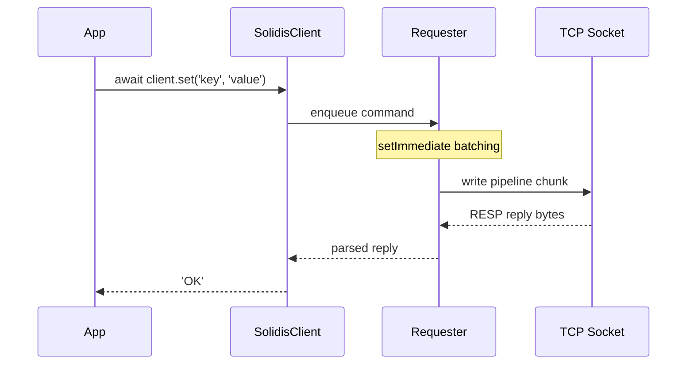

<h1 align="center"></h1>

<h3 align="center">
  <b>The fastest Redis client for Node.js.<br/>Zero dependencies, 2x+ faster than ioredis, battle-tested in production.</b>
</h3>

<br/>

<p align="center">
  <a href="https://www.npmjs.com/package/@vcms-io/solidis"></a>
  <a href="https://github.com/vcms-io/solidis"></a>
  <a href="https://github.com/vcms-io/solidis"></a>
  <a href="https://github.com/vcms-io/solidis"></a>
  <a href="https://github.com/vcms-io/solidis"></a>
  <a href="https://github.com/vcms-io/solidis"></a>
</p>

<p align="center">
  <a href="#quick-start">Quick Start</a>&nbsp;&nbsp;·&nbsp;&nbsp;<a href="#features">Features</a>&nbsp;&nbsp;·&nbsp;&nbsp;<a href="#configuration">Configuration</a>&nbsp;&nbsp;·&nbsp;&nbsp;<a href="#architecture">Architecture</a>&nbsp;&nbsp;·&nbsp;&nbsp;<a href="#extensions">Extensions</a>&nbsp;&nbsp;·&nbsp;&nbsp;<a href="./README.ko.md">한국어</a>
</p>

<br/>

<p align="center">
  
</p>

<table align="center">
<tr>
<td align="center"><br/><strong>0 deps</strong><br/><sub>zero dependencies</sub></td>
<td align="center"><br/><strong>383</strong><br/><sub>commands</sub></td>
<td align="center"><br/><strong>19K+</strong><br/><sub>lines of tests</sub></td>
<td align="center"><br/><strong>&lt; 29KB</strong><br/><sub>min bundle</sub></td>
</tr>
</table>

<br/>

## Quick Start

```bash
npm install @vcms-io/solidis
```

```typescript
import { SolidisFeaturedClient } from '@vcms-io/solidis/featured';

const client = new SolidisFeaturedClient({ host: '127.0.0.1', port: 6379 });

await client.set('key', 'value');
const value = await client.get('key');
```

> [!TIP]
> **Need a smaller bundle?** Use `SolidisClient` with `.extend()` to import only the commands you use.
> Minimum bundle drops to **< 29KB** with tree-shaking.

<details>
<summary>&nbsp;&nbsp;<b>Tree-shakable client</b></summary>

<br/>

```typescript
import { SolidisClient } from '@vcms-io/solidis';
import { get } from '@vcms-io/solidis/command/get';
import { set } from '@vcms-io/solidis/command/set';

import type { SolidisClientExtensions } from '@vcms-io/solidis';

const extensions = { get, set } satisfies SolidisClientExtensions;
const client = new SolidisClient({ host: '127.0.0.1', port: 6379 }).extend(extensions);
```

</details>

<details>
<summary>&nbsp;&nbsp;<b>Transactions & Pipelines</b></summary>

<br/>

```typescript
// Transaction (MULTI/EXEC)
const tx = client.multi();
tx.set('key', 'value');
tx.incr('counter');
const results = await tx.exec();

// Pipeline (raw)
const results = await client.send([
  ['set', 'a', '1'],
  ['incr', 'counter'],
  ['get', 'a']
]);
```

</details>

<details>
<summary>&nbsp;&nbsp;<b>Pub/Sub</b></summary>

<br/>

```typescript
client.on('message', (channel, message) => {
  console.log(`${channel}: ${message}`);
});
await client.subscribe('events');
```

</details>

<br/>

<div id="benchmark">

##  Benchmarks

<div align="center">

#  Solidis vs ioredis 

<small>Generated on 2026-06-22 15:21:54 · linux x64 · Node.js v22.22.3</small>

### Up to **2.1x faster** than ioredis! 

---

<br/>

**15** / **15** benchmarks won · **74%** average speed improvement · **111%** peak speed improvement

_100,000 iterations × 10,000 concurrency · 1 KB payload · 10 repeats_

|                                                                                                                                                                                        | Benchmark           |                                                Commands                                                 |  solidis   | ioredis |                                                                                                                                                                       Difference                                                                                                                                                                        | Performance  |
| -------------------------------------------------------------------------------------------------------------------------------------------------------------------------------------: | :------------------ | :-----------------------------------------------------------------------------------------------------: | :--------: | :-----: | :-----------------------------------------------------------------------------------------------------------------------------------------------------------------------------------------------------------------------------------------------------------------------------------------------------------------------------------------------------: | :----------- |
|  | **Set Mutation**    |               <sup><sub><kbd>SADD</kbd> <kbd>SISMEMBER</kbd> <kbd>SREM</kbd></sub></sup>                | **1610ms** | 3398ms  | **2.1x**  | `██████████` |
|  | **List Mutation**   | <sup><sub><kbd>LPUSH</kbd> <kbd>RPUSH</kbd> <kbd>LPOP</kbd> <kbd>RPOP</kbd> <kbd>LLEN</kbd></sub></sup> | **2475ms** | 4597ms  | **1.9x**  | `████████░░` |
|  | **Set Read**        |             <sup><sub><kbd>SADD</kbd> <kbd>SISMEMBER</kbd> <kbd>SMEMBERS</kbd></sub></sup>              | **1703ms** | 3142ms  | **1.8x**  | `████████░░` |
|                                                                                                                                                                                     4. | **Sorted Set**      |                 <sup><sub><kbd>ZADD</kbd> <kbd>ZRANGE</kbd> <kbd>ZREM</kbd></sub></sup>                 | **1734ms** | 3182ms  | **1.8x**  | `████████░░` |
|                                                                                                                                                                                     5. | **Set**             |                                  <sup><sub><kbd>SET</kbd></sub></sup>                                   | **754ms**  | 1367ms  | **1.8x**  | `███████░░░` |
|                                                                                                                                                                                     6. | **Expire**          |                  <sup><sub><kbd>SET</kbd> <kbd>EXPIRE</kbd> <kbd>TTL</kbd></sub></sup>                  | **1522ms** | 2751ms  | **1.8x**  | `███████░░░` |
|                                                                                                                                                                                     7. | **List Range**      |                <sup><sub><kbd>LPUSH</kbd> <kbd>RPUSH</kbd> <kbd>LRANGE</kbd></sub></sup>                | **2045ms** | 3692ms  | **1.8x**  | `███████░░░` |
|                                                                                                                                                                                     8. | **Hash Mutation**   |                 <sup><sub><kbd>HMSET</kbd> <kbd>HMGET</kbd> <kbd>HDEL</kbd></sub></sup>                 | **2052ms** | 3564ms  | **1.7x**  | `███████░░░` |
|                                                                                                                                                                                     9. | **Multi-Key**       |                          <sup><sub><kbd>MSET</kbd> <kbd>MGET</kbd></sub></sup>                          | **1475ms** | 2551ms  | **1.7x**  | `███████░░░` |
|                                                                                                                                                                                    10. | **Stream**          |                 <sup><sub><kbd>XADD</kbd> <kbd>XRANGE</kbd> <kbd>XLEN</kbd></sub></sup>                 | **1847ms** | 3189ms  | **1.7x**  | `███████░░░` |
|                                                                                                                                                                                    11. | **Non-Transaction** |                          <sup><sub><kbd>SETPX</kbd> <kbd>GET</kbd></sub></sup>                          | **1348ms** | 2269ms  | **1.7x**  | `██████░░░░` |
|                                                                                                                                                                                    12. | **Pipeline Mixed**  |                   <sup><sub><kbd>SET</kbd> <kbd>INCR</kbd> <kbd>GET</kbd></sub></sup>                   | **1688ms** | 2738ms  | **1.6x**  | `██████░░░░` |
|                                                                                                                                                                                    13. | **Counter**         |                          <sup><sub><kbd>INCR</kbd> <kbd>DECR</kbd></sub></sup>                          | **1015ms** | 1599ms  |                                                                                    **1.6x**                                                                                      | `█████░░░░░` |
|                                                                                                                                                                                    14. | **Hash Round-Trip** |                <sup><sub><kbd>HSET</kbd> <kbd>HGET</kbd> <kbd>HGETALL</kbd></sub></sup>                 | **1901ms** | 2827ms  |                                                                                    **1.5x**                                                                                      | `████░░░░░░` |
|                                                                                                                                                                                    15. | **Get Buffer**      |                               <sup><sub><kbd>GETBUFFER</kbd></sub></sup>                                | **624ms**  |  928ms  |                                                                                    **1.5x**                                                                                      | `████░░░░░░` |

### Non Strictly Comparable Benchmarks

<sub>These benchmarks have library-specific behavior that prevents a strictly fair comparison.</sub>

|     | Benchmark             |                               Commands                                | solidis | ioredis |                                                                                                                                                                       Difference                                                                                                                                                                        | Performance  |
| --: | :-------------------- | :-------------------------------------------------------------------: | :-----: | :-----: | :-----------------------------------------------------------------------------------------------------------------------------------------------------------------------------------------------------------------------------------------------------------------------------------------------------------------------------------------------------: | :----------- |
| 16. | **Transaction**       | <sup><sub><kbd>SET</kbd> <kbd>EXPIRE</kbd> <kbd>GET</kbd></sub></sup> | 1397ms  | 6579ms  | **4.7x**  | `██████████` |
| 17. | **Transaction Mixed** |          <sup><sub><kbd>SET</kbd> <kbd>GET</kbd></sub></sup>          | 1400ms  | 4695ms  | **3.4x**  | `██████████` |
| 18. | **Pub/Sub**           |      <sup><sub><kbd>PUBLISH</kbd> <kbd>MESSAGE</kbd></sub></sup>      |  754ms  | 2476ms  | **3.3x**  | `██████████` |
| 19. | **Info / Config**     |      <sup><sub><kbd>INFO</kbd> <kbd>CONFIGGET</kbd></sub></sup>       | 1168ms  | 2042ms  | **1.7x**  | `███████░░░` |

<sub>Ranked by performance gain of `solidis` over `ioredis` (baseline). Elapsed = median time across repeats.</sub>

</div>

<br/>

##  Detailed Metrics

<sub>All metrics per library: operations/s, commands/s, median elapsed time, and spread (coefficient of variation).</sub>

<details>
<summary>Click to expand detailed metrics table</summary>

| Benchmark                                                                                                                                      | Library     |  ops/s | cmds/s | Elapsed | Spread |
| :--------------------------------------------------------------------------------------------------------------------------------------------- | :---------- | -----: | -----: | ------: | -----: |
| **Set Mutation: <sup><sub><kbd>SADD</kbd> <kbd>SISMEMBER</kbd> <kbd>SREM</kbd></sub></sup>**<br/><sub>1 KB</sub>                               | **solidis** |  62.1K | 186.4K |  1610ms |  ±8.9% |
|                                                                                                                                                | ioredis     |  29.4K |  88.3K |  3398ms |  ±5.1% |
| **List Mutation: <sup><sub><kbd>LPUSH</kbd> <kbd>RPUSH</kbd> <kbd>LPOP</kbd> <kbd>RPOP</kbd> <kbd>LLEN</kbd></sub></sup>**<br/><sub>1 KB</sub> | **solidis** |  40.4K | 202.0K |  2475ms |  ±1.4% |
|                                                                                                                                                | ioredis     |  21.8K | 108.8K |  4597ms |  ±3.3% |
| **Set Read: <sup><sub><kbd>SADD</kbd> <kbd>SISMEMBER</kbd> <kbd>SMEMBERS</kbd></sub></sup>**<br/><sub>1 KB</sub>                               | **solidis** |  58.7K | 176.2K |  1703ms |  ±1.2% |
|                                                                                                                                                | ioredis     |  31.8K |  95.5K |  3142ms |  ±1.2% |
| **Sorted Set: <sup><sub><kbd>ZADD</kbd> <kbd>ZRANGE</kbd> <kbd>ZREM</kbd></sub></sup>**<br/><sub>1 KB</sub>                                    | **solidis** |  57.7K | 173.0K |  1734ms |  ±2.0% |
|                                                                                                                                                | ioredis     |  31.4K |  94.3K |  3182ms |  ±1.4% |
| **Set: <sup><sub><kbd>SET</kbd></sub></sup>**<br/><sub>1 KB</sub>                                                                              | **solidis** | 132.6K | 132.6K |   754ms |  ±8.0% |
|                                                                                                                                                | ioredis     |  73.1K |  73.1K |  1367ms |  ±2.1% |
| **Expire: <sup><sub><kbd>SET</kbd> <kbd>EXPIRE</kbd> <kbd>TTL</kbd></sub></sup>**<br/><sub>1 KB</sub>                                          | **solidis** |  65.7K | 197.1K |  1522ms |  ±2.3% |
|                                                                                                                                                | ioredis     |  36.3K | 109.0K |  2751ms |  ±3.1% |
| **List Range: <sup><sub><kbd>LPUSH</kbd> <kbd>RPUSH</kbd> <kbd>LRANGE</kbd></sub></sup>**<br/><sub>1 KB</sub>                                  | **solidis** |  48.9K | 146.7K |  2045ms |  ±1.9% |
|                                                                                                                                                | ioredis     |  27.1K |  81.3K |  3692ms |  ±1.6% |
| **Hash Mutation: <sup><sub><kbd>HMSET</kbd> <kbd>HMGET</kbd> <kbd>HDEL</kbd></sub></sup>**<br/><sub>1 KB</sub>                                 | **solidis** |  48.7K | 146.2K |  2052ms |  ±3.1% |
|                                                                                                                                                | ioredis     |  28.1K |  84.2K |  3564ms |  ±1.0% |
| **Multi-Key: <sup><sub><kbd>MSET</kbd> <kbd>MGET</kbd></sub></sup>**<br/><sub>1 KB</sub>                                                       | **solidis** |  67.8K | 135.6K |  1475ms |  ±3.3% |
|                                                                                                                                                | ioredis     |  39.2K |  78.4K |  2551ms |  ±1.8% |
| **Stream: <sup><sub><kbd>XADD</kbd> <kbd>XRANGE</kbd> <kbd>XLEN</kbd></sub></sup>**<br/><sub>1 KB</sub>                                        | **solidis** |  54.1K | 162.4K |  1847ms |  ±1.6% |
|                                                                                                                                                | ioredis     |  31.4K |  94.1K |  3189ms |  ±2.8% |
| **Non-Transaction: <sup><sub><kbd>SETPX</kbd> <kbd>GET</kbd></sub></sup>**<br/><sub>1 KB</sub>                                                 | **solidis** |  74.2K | 148.3K |  1348ms |  ±8.4% |
|                                                                                                                                                | ioredis     |  44.1K |  88.2K |  2269ms |  ±1.2% |
| **Pipeline Mixed: <sup><sub><kbd>SET</kbd> <kbd>INCR</kbd> <kbd>GET</kbd></sub></sup>**<br/><sub>1 KB</sub>                                    | **solidis** |  59.2K | 177.7K |  1688ms |  ±9.3% |
|                                                                                                                                                | ioredis     |  36.5K | 109.6K |  2738ms |  ±2.4% |
| **Counter: <sup><sub><kbd>INCR</kbd> <kbd>DECR</kbd></sub></sup>**<br/><sub>1 KB</sub>                                                         | **solidis** |  98.5K | 197.0K |  1015ms |  ±4.0% |
|                                                                                                                                                | ioredis     |  62.5K | 125.0K |  1599ms |  ±2.8% |
| **Hash Round-Trip: <sup><sub><kbd>HSET</kbd> <kbd>HGET</kbd> <kbd>HGETALL</kbd></sub></sup>**<br/><sub>1 KB</sub>                              | **solidis** |  52.6K | 157.8K |  1901ms |  ±2.3% |
|                                                                                                                                                | ioredis     |  35.4K | 106.1K |  2827ms |  ±5.5% |
| **Get Buffer: <sup><sub><kbd>GETBUFFER</kbd></sub></sup>**<br/><sub>1 KB</sub>                                                                 | **solidis** | 160.1K | 160.1K |   624ms |  ±7.2% |
|                                                                                                                                                | ioredis     | 107.7K | 107.7K |   928ms |  ±2.2% |

</details>

---

##  Configuration

<details>
<summary>Click to expand benchmark configuration</summary>

| Parameter            | Value               |
| :------------------- | :------------------ |
| Mode                 | `autopipeline`      |
| Payload Sizes        | 1 KB                |
| Iterations           | 100,000             |
| Warmup               | 1,000               |
| Clients              | 1                   |
| Concurrency / Client | 10000               |
| Total Concurrency    | 10000               |
| Repeats              | 10                  |
| Cooldown             | 2500ms              |
| Platform             | linux x64           |
| Node.js              | v22.22.3            |
| Date                 | 2026-06-22 15:21:54 |

</details>

---

##  Methodology

- Each benchmark is run in an **isolated worker thread** to prevent GC and JIT cross-contamination
- Libraries are **alternated** between repeats to reduce ordering bias
- The Redis server is **flushed and settled** between each benchmark case
- Payloads use a **deterministic pseudo-random pool** shared by both libraries
- Elapsed time is the **median** across all repeat samples
- Spread is the **coefficient of variation** (σ / median × 100%)

</div>

## Features

<table>
<tr>
<td width="50%" valign="top">

###  Performance

- `setImmediate` pipeline coalescing
- Binary-safe RESP parser with owned buffers
- Chunked socket writes with backpressure
- Configurable event-loop yield points

</td>
<td width="50%" valign="top">

###  Protocol

- Full RESP2 + RESP3 wire-level implementation
- All 17 RESP3 data types (Map, Set, Push, BigNumber, ...)
- Automatic BigInt promotion for unsafe integers
- Binary-safe, multi-byte character support

</td>
</tr>
<tr>
<td width="50%" valign="top">

###  Reliability

- Auto-reconnect with configurable backoff
- Auto-recovery: SELECT, Pub/Sub subscriptions
- Per-pipeline command timeout
- Ready check (waits for server loading)
- Deterministic in-flight rejection on fault

</td>
<td width="50%" valign="top">

###  Security

- TLS/SSL (`rediss://` or explicit `tls` option)
- ACL username/password authentication
- Credential masking in debug output
- `maxBulkStringLength` oversized reply guard

</td>
</tr>
<tr>
<td width="50%" valign="top">

###  Type Safety

- TypeScript `strict` with per-command I/O types
- Runtime reply guards (`tryReplyToString`, ...)
- Structured error hierarchy + causal chain

</td>
<td width="50%" valign="top">

###  Extensibility

- `.extend()` for tree-shakable command composition
- Custom commands with full client `this` binding
- MULTI/EXEC proxy with banned-method enforcement

</td>
</tr>
</table>

## Configuration

<details>
<summary><b>Full options reference</b></summary>

```typescript
const client = new SolidisClient({
  // Connection
  uri: 'redis://localhost:6379',
  host: '127.0.0.1',
  port: 6379,
  tls: { /* tls.ConnectionOptions */ },
  lazyConnect: false,

  // Auth
  authentication: { username: 'user', password: 'pass' },
  database: 0,

  // Protocol & Recovery
  clientName: 'solidis',
  protocol: 'RESP2',                      // 'RESP2' | 'RESP3'
  autoReconnect: true,
  enableReadyCheck: true,
  maxReadyCheckRetries: 100,
  readyCheckInterval: 100,
  maxConnectionRetries: 20,
  connectionRetryDelay: 100,
  autoRecovery: {
    database: true,
    subscribe: true,
    ssubscribe: true,
    psubscribe: true,
  },

  // Timeouts (ms)
  commandTimeout: 5000,
  connectionTimeout: 2000,
  socketWriteTimeout: 1000,

  // Performance
  maxCommandsPerPipeline: 300,
  maxProcessRepliesPerChunk: 4096,
  maxProcessReplyBytesPerChunk: 8_388_608,  // 8MB
  maxSocketWriteSizePerOnce: 65_536,        // 64KB
  rejectOnPartialPipelineError: false,

  // Parser
  parser: {
    buffer: { initial: 4_194_304, shiftThreshold: 2_097_152 },
    maxBulkStringLength: 536_870_912,       // 512MB
  },

  // Misc
  maxEventListenersForClient: 10_240,
  maxEventListenersForSocket: 10_240,
  debug: false,
  debugMaxEntries: 10_240,
});
```

</details>

## Architecture




## Events

```typescript
client.on('connect', () => {});         // TCP connected
client.on('ready', () => {});           // Auth done, ready for commands
client.on('reconnected', () => {});     // Re-established after disconnect
client.on('end', () => {});             // Connection closed
client.on('error', (err) => {});        // Non-fatal error
client.on('message', (ch, msg) => {});  // Pub/Sub message
client.on('pmessage', (pat, ch, msg) => {});
client.on('smessage', (ch, msg) => {}); // Shard channel
client.on('debug', (entry) => {});      // Debug log entry
```

## Error Handling

```typescript
import { unwrapSolidisError, SolidisConnectionError, SolidisRequesterError } from '@vcms-io/solidis';

try {
  await client.set('key', 'value');
} catch (error) {
  const root = unwrapSolidisError(error); // full causal chain
}
```

> [!NOTE]
> Every error thrown by Solidis is an instance of `SolidisError`.
> Use `unwrapSolidisError()` to traverse the full causal chain to the root cause.

| Error Class              | When                                               |
| :----------------------- | :------------------------------------------------- |
| `SolidisConnectionError` | TCP/TLS connect failure, timeout, reset            |
| `SolidisRequesterError`  | Command timeout, pipeline rejection, write failure |
| `SolidisParserError`     | Malformed RESP, oversized bulk string              |
| `SolidisPubSubError`     | Subscription lifecycle error                       |

## Extensions

```bash
npm install @vcms-io/solidis-extensions
```

| Extension                                                                                                  | Description                                         |
| :--------------------------------------------------------------------------------------------------------- | :-------------------------------------------------- |
| [**SpinLock**](https://github.com/vcms-io/solidis-extensions/blob/main/sources/domains/spinlock/README.md) | Lightweight Redis-backed mutex (single instance)    |
| [**RedLock**](https://github.com/vcms-io/solidis-extensions/blob/main/sources/domains/redlock/README.md)   | Fault-tolerant distributed lock (Redlock algorithm) |

## Contributing

```bash
git clone https://github.com/vcms-io/solidis.git && cd solidis
npm install && npm run build && npm test
```

<sub>TypeScript strict · zero new deps · minimal bundle impact · SemVer</sub>

## License

MIT · See [LICENSE](/LICENSE)
