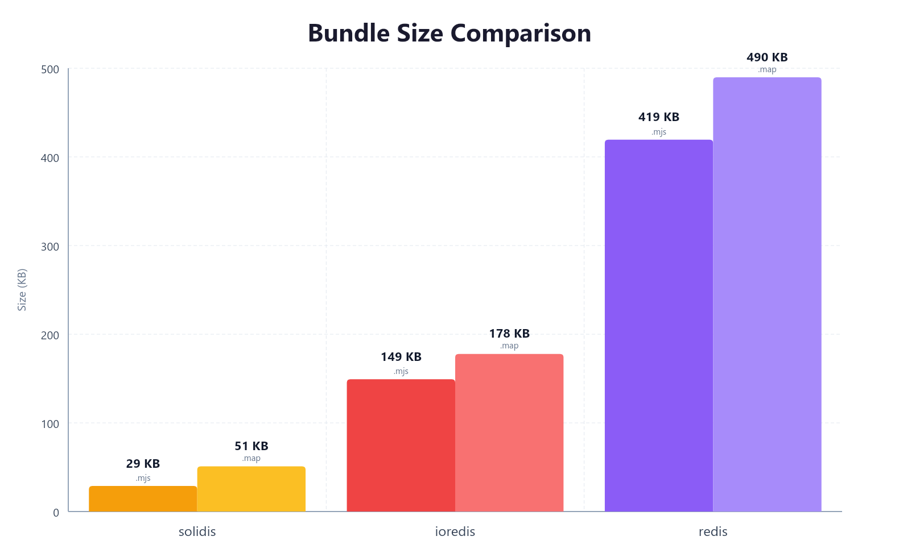
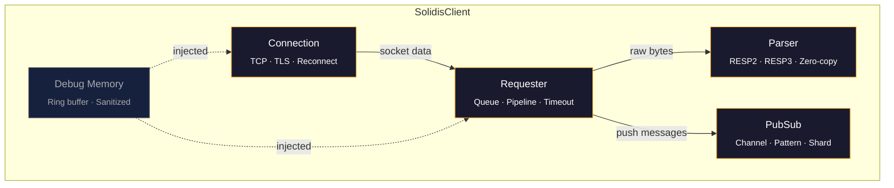
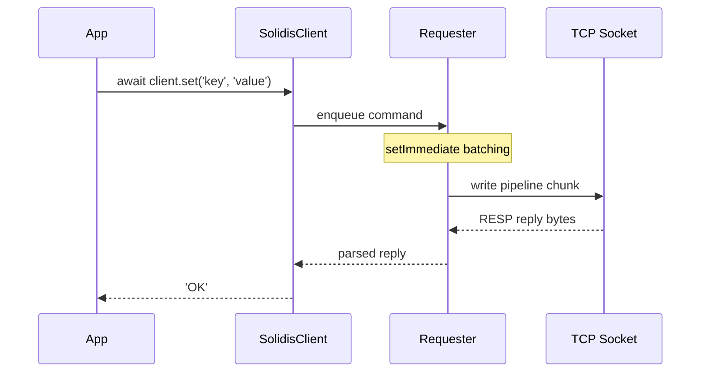

<h1 align="center"></h1>

<p align="center">
  <b>Zero-dependency RESP client for Redis. Fastest by design.</b>
</p>

<p align="center">
  <a href="https://www.npmjs.com/package/@vcms-io/solidis"></a>
  <a href="https://github.com/vcms-io/solidis"></a>
  <a href="https://github.com/vcms-io/solidis"></a>
  <a href="https://github.com/vcms-io/solidis"></a>
  <a href="https://github.com/vcms-io/solidis"></a>
  <a href="https://github.com/vcms-io/solidis"></a>
</p>

<p align="center">
  <a href="#quick-start">Quick Start</a>&nbsp;&nbsp;·&nbsp;&nbsp;<a href="#features">Features</a>&nbsp;&nbsp;·&nbsp;&nbsp;<a href="#configuration">Configuration</a>&nbsp;&nbsp;·&nbsp;&nbsp;<a href="#architecture">Architecture</a>&nbsp;&nbsp;·&nbsp;&nbsp;<a href="#extensions">Extensions</a>&nbsp;&nbsp;·&nbsp;&nbsp;<a href="./README.ko.md">한국어</a>
</p>

<br/>

<p align="center">
  
</p>

<table align="center">
<tr>
<td align="center"><br/><strong>0 deps</strong><br/><sub>zero dependencies</sub></td>
<td align="center"><br/><strong>383</strong><br/><sub>commands</sub></td>
<td align="center"><br/><strong>19K+</strong><br/><sub>lines of tests</sub></td>
<td align="center"><br/><strong>&lt; 29KB</strong><br/><sub>min bundle</sub></td>
</tr>
</table>

<br/>

## Quick Start

```bash
npm install @vcms-io/solidis
```

```typescript
import { SolidisFeaturedClient } from '@vcms-io/solidis/featured';

const client = new SolidisFeaturedClient({ host: '127.0.0.1', port: 6379 });

await client.set('key', 'value');
const value = await client.get('key');
```

> [!TIP]
> **Need a smaller bundle?** Use `SolidisClient` with `.extend()` to import only the commands you use.
> Minimum bundle drops to **< 29KB** with tree-shaking.

<details>
<summary>&nbsp;&nbsp;<b>Tree-shakable client</b></summary>

<br/>

```typescript
import { SolidisClient } from '@vcms-io/solidis';
import { get } from '@vcms-io/solidis/command/get';
import { set } from '@vcms-io/solidis/command/set';

import type { SolidisClientExtensions } from '@vcms-io/solidis';

const extensions = { get, set } satisfies SolidisClientExtensions;
const client = new SolidisClient({ host: '127.0.0.1', port: 6379 }).extend(extensions);
```

</details>

<details>
<summary>&nbsp;&nbsp;<b>Transactions & Pipelines</b></summary>

<br/>

```typescript
// Transaction (MULTI/EXEC)
const tx = client.multi();
tx.set('key', 'value');
tx.incr('counter');
const results = await tx.exec();

// Pipeline (raw)
const results = await client.send([
  ['set', 'a', '1'],
  ['incr', 'counter'],
  ['get', 'a']
]);
```

</details>

<details>
<summary>&nbsp;&nbsp;<b>Pub/Sub</b></summary>

<br/>

```typescript
client.on('message', (channel, message) => {
  console.log(`${channel}: ${message}`);
});
await client.subscribe('events');
```

</details>

<br/>

<div id="benchmark">

##  Benchmarks

<div align="center">

#  Solidis vs ioredis 

<small>Generated on 2026-06-19 17:48:54 · linux x64 · Node.js v22.22.3</small>
### Up to **2.1x faster** than ioredis! 

---
<br/>

**15** / **15** benchmarks won · **72%** average speed improvement · **109%** peak speed improvement

*100,000 iterations × 10,000 concurrency · 1 KB payload · 10 repeats*

| | Benchmark | Commands | solidis | ioredis | Difference | Performance |
|---:|:---|:---:|:---:|:---:|:---:|:---|
|  | **Set Mutation** | <sup><sub><kbd>SADD</kbd> <kbd>SISMEMBER</kbd> <kbd>SREM</kbd></sub></sup> | **1638ms** | 3419ms | **2.1x**  | `██████████` |
|  | **List Mutation** | <sup><sub><kbd>LPUSH</kbd> <kbd>RPUSH</kbd> <kbd>LPOP</kbd> <kbd>RPOP</kbd> <kbd>LLEN</kbd></sub></sup> | **2373ms** | 4520ms | **1.9x**  | `████████░░` |
|  | **List Range** | <sup><sub><kbd>LPUSH</kbd> <kbd>RPUSH</kbd> <kbd>LRANGE</kbd></sub></sup> | **1905ms** | 3616ms | **1.9x**  | `████████░░` |
| 4. | **Hash Mutation** | <sup><sub><kbd>HMSET</kbd> <kbd>HMGET</kbd> <kbd>HDEL</kbd></sub></sup> | **1869ms** | 3391ms | **1.8x**  | `███████░░░` |
| 5. | **Set** | <sup><sub><kbd>SET</kbd></sub></sup> | **763ms** | 1379ms | **1.8x**  | `███████░░░` |
| 6. | **Expire** | <sup><sub><kbd>SET</kbd> <kbd>EXPIRE</kbd> <kbd>TTL</kbd></sub></sup> | **1495ms** | 2598ms | **1.7x**  | `███████░░░` |
| 7. | **Set Read** | <sup><sub><kbd>SADD</kbd> <kbd>SISMEMBER</kbd> <kbd>SMEMBERS</kbd></sub></sup> | **1876ms** | 3205ms | **1.7x**  | `███████░░░` |
| 8. | **Stream** | <sup><sub><kbd>XADD</kbd> <kbd>XRANGE</kbd> <kbd>XLEN</kbd></sub></sup> | **1856ms** | 3162ms | **1.7x**  | `██████░░░░` |
| 9. | **Sorted Set** | <sup><sub><kbd>ZADD</kbd> <kbd>ZRANGE</kbd> <kbd>ZREM</kbd></sub></sup> | **1925ms** | 3275ms | **1.7x**  | `██████░░░░` |
| 10. | **Multi-Key** | <sup><sub><kbd>MSET</kbd> <kbd>MGET</kbd></sub></sup> | **1769ms** | 2946ms | **1.7x**  | `██████░░░░` |
| 11. | **Non-Transaction** | <sup><sub><kbd>SETPX</kbd> <kbd>GET</kbd></sub></sup> | **1307ms** | 2169ms | **1.7x**  | `██████░░░░` |
| 12. | **Pipeline Mixed** | <sup><sub><kbd>SET</kbd> <kbd>INCR</kbd> <kbd>GET</kbd></sub></sup> | **1580ms** | 2546ms | **1.6x**  | `██████░░░░` |
| 13. | **Counter** | <sup><sub><kbd>INCR</kbd> <kbd>DECR</kbd></sub></sup> | **903ms** | 1397ms | **1.5x**  | `█████░░░░░` |
| 14. | **Hash Round-Trip** | <sup><sub><kbd>HSET</kbd> <kbd>HGET</kbd> <kbd>HGETALL</kbd></sub></sup> | **1777ms** | 2706ms | **1.5x**  | `█████░░░░░` |
| 15. | **Get Buffer** | <sup><sub><kbd>GETBUFFER</kbd></sub></sup> | **598ms** | 883ms | **1.5x**  | `████░░░░░░` |

### Non Strictly Comparable Benchmarks

<sub>These benchmarks have library-specific behavior that prevents a strictly fair comparison.</sub>

| | Benchmark | Commands | solidis | ioredis | Difference | Performance |
|---:|:---|:---:|:---:|:---:|:---:|:---|
| 16. | **Transaction** | <sup><sub><kbd>SET</kbd> <kbd>EXPIRE</kbd> <kbd>GET</kbd></sub></sup> | 1257ms | 5958ms | **4.7x**  | `██████████` |
| 17. | **Transaction Mixed** | <sup><sub><kbd>SET</kbd> <kbd>GET</kbd></sub></sup> | 1641ms | 7003ms | **4.3x**  | `██████████` |
| 18. | **Pub/Sub** | <sup><sub><kbd>PUBLISH</kbd> <kbd>MESSAGE</kbd></sub></sup> | 558ms | 2078ms | **3.7x**  | `██████████` |
| 19. | **Info / Config** | <sup><sub><kbd>INFO</kbd> <kbd>CONFIGGET</kbd></sub></sup> | 1063ms | 2160ms | **2.0x**  | `█████████░` |

<sub>Ranked by performance gain of `solidis` over `ioredis` (baseline). Elapsed = median time across repeats.</sub>

</div>

<br/>

##  Detailed Metrics

<sub>All metrics per library: operations/s, commands/s, median elapsed time, and spread (coefficient of variation).</sub>

<details>
<summary>Click to expand detailed metrics table</summary>

| Benchmark | Library | ops/s | cmds/s | Elapsed | Spread |
|:---|:---|---:|---:|---:|---:|
| **Set Mutation: <sup><sub><kbd>SADD</kbd> <kbd>SISMEMBER</kbd> <kbd>SREM</kbd></sub></sup>**<br/><sub>1 KB</sub> | **solidis** | 61.0K | 183.1K | 1638ms | ±7.5% |
|  | ioredis | 29.2K | 87.7K | 3419ms | ±2.3% |
| **List Mutation: <sup><sub><kbd>LPUSH</kbd> <kbd>RPUSH</kbd> <kbd>LPOP</kbd> <kbd>RPOP</kbd> <kbd>LLEN</kbd></sub></sup>**<br/><sub>1 KB</sub> | **solidis** | 42.1K | 210.7K | 2373ms | ±3.4% |
|  | ioredis | 22.1K | 110.6K | 4520ms | ±0.8% |
| **List Range: <sup><sub><kbd>LPUSH</kbd> <kbd>RPUSH</kbd> <kbd>LRANGE</kbd></sub></sup>**<br/><sub>1 KB</sub> | **solidis** | 52.5K | 157.5K | 1905ms | ±7.9% |
|  | ioredis | 27.7K | 83.0K | 3616ms | ±1.6% |
| **Hash Mutation: <sup><sub><kbd>HMSET</kbd> <kbd>HMGET</kbd> <kbd>HDEL</kbd></sub></sup>**<br/><sub>1 KB</sub> | **solidis** | 53.5K | 160.5K | 1869ms | ±4.4% |
|  | ioredis | 29.5K | 88.5K | 3391ms | ±3.2% |
| **Set: <sup><sub><kbd>SET</kbd></sub></sup>**<br/><sub>1 KB</sub> | **solidis** | 131.1K | 131.1K | 763ms | ±7.7% |
|  | ioredis | 72.5K | 72.5K | 1379ms | ±2.6% |
| **Expire: <sup><sub><kbd>SET</kbd> <kbd>EXPIRE</kbd> <kbd>TTL</kbd></sub></sup>**<br/><sub>1 KB</sub> | **solidis** | 66.9K | 200.6K | 1495ms | ±2.7% |
|  | ioredis | 38.5K | 115.5K | 2598ms | ±0.9% |
| **Set Read: <sup><sub><kbd>SADD</kbd> <kbd>SISMEMBER</kbd> <kbd>SMEMBERS</kbd></sub></sup>**<br/><sub>1 KB</sub> | **solidis** | 53.3K | 159.9K | 1876ms | ±7.6% |
|  | ioredis | 31.2K | 93.6K | 3205ms | ±2.1% |
| **Stream: <sup><sub><kbd>XADD</kbd> <kbd>XRANGE</kbd> <kbd>XLEN</kbd></sub></sup>**<br/><sub>1 KB</sub> | **solidis** | 53.9K | 161.6K | 1856ms | ±3.8% |
|  | ioredis | 31.6K | 94.9K | 3162ms | ±1.7% |
| **Sorted Set: <sup><sub><kbd>ZADD</kbd> <kbd>ZRANGE</kbd> <kbd>ZREM</kbd></sub></sup>**<br/><sub>1 KB</sub> | **solidis** | 51.9K | 155.8K | 1925ms | ±4.8% |
|  | ioredis | 30.5K | 91.6K | 3275ms | ±1.4% |
| **Multi-Key: <sup><sub><kbd>MSET</kbd> <kbd>MGET</kbd></sub></sup>**<br/><sub>1 KB</sub> | **solidis** | 56.5K | 113.1K | 1769ms | ±1.9% |
|  | ioredis | 33.9K | 67.9K | 2946ms | ±4.3% |
| **Non-Transaction: <sup><sub><kbd>SETPX</kbd> <kbd>GET</kbd></sub></sup>**<br/><sub>1 KB</sub> | **solidis** | 76.5K | 153.0K | 1307ms | ±6.1% |
|  | ioredis | 46.1K | 92.2K | 2169ms | ±5.6% |
| **Pipeline Mixed: <sup><sub><kbd>SET</kbd> <kbd>INCR</kbd> <kbd>GET</kbd></sub></sup>**<br/><sub>1 KB</sub> | **solidis** | 63.3K | 189.9K | 1580ms | ±1.6% |
|  | ioredis | 39.3K | 117.8K | 2546ms | ±0.5% |
| **Counter: <sup><sub><kbd>INCR</kbd> <kbd>DECR</kbd></sub></sup>**<br/><sub>1 KB</sub> | **solidis** | 110.7K | 221.4K | 903ms | ±2.7% |
|  | ioredis | 71.6K | 143.1K | 1397ms | ±6.6% |
| **Hash Round-Trip: <sup><sub><kbd>HSET</kbd> <kbd>HGET</kbd> <kbd>HGETALL</kbd></sub></sup>**<br/><sub>1 KB</sub> | **solidis** | 56.3K | 168.8K | 1777ms | ±3.1% |
|  | ioredis | 37.0K | 110.9K | 2706ms | ±3.7% |
| **Get Buffer: <sup><sub><kbd>GETBUFFER</kbd></sub></sup>**<br/><sub>1 KB</sub> | **solidis** | 167.2K | 167.2K | 598ms | ±2.3% |
|  | ioredis | 113.3K | 113.3K | 883ms | ±2.2% |

</details>

---

##  Configuration

<details>
<summary>Click to expand benchmark configuration</summary>

| Parameter | Value |
|:----------|:------|
| Mode | `autopipeline` |
| Payload Sizes | 1 KB |
| Iterations | 100,000 |
| Warmup | 1,000 |
| Clients | 1 |
| Concurrency / Client | 10000 |
| Total Concurrency | 10000 |
| Repeats | 10 |
| Cooldown | 2500ms |
| Platform | linux x64 |
| Node.js | v22.22.3 |
| Date | 2026-06-19 17:48:54 |

</details>

---

##  Methodology

- Each benchmark is run in an **isolated worker thread** to prevent GC and JIT cross-contamination
- Libraries are **alternated** between repeats to reduce ordering bias
- The Redis server is **flushed and settled** between each benchmark case
- Payloads use a **deterministic pseudo-random pool** shared by both libraries
- Elapsed time is the **median** across all repeat samples
- Spread is the **coefficient of variation** (σ / median × 100%)

</div>

## Features

<table>
<tr>
<td width="50%" valign="top">

###  Performance

- `setImmediate` pipeline coalescing
- Zero-copy RESP parser (borrowed buffer slices)
- Chunked socket writes with backpressure
- Configurable event-loop yield points

</td>
<td width="50%" valign="top">

###  Protocol

- Full RESP2 + RESP3 wire-level implementation
- All 17 RESP3 data types (Map, Set, Push, BigNumber, ...)
- Automatic BigInt promotion for unsafe integers
- Binary-safe, multi-byte character support

</td>
</tr>
<tr>
<td width="50%" valign="top">

###  Reliability

- Auto-reconnect with configurable backoff
- Auto-recovery: SELECT, Pub/Sub subscriptions
- Per-pipeline command timeout
- Ready check (waits for server loading)
- Deterministic in-flight rejection on fault

</td>
<td width="50%" valign="top">

###  Security

- TLS/SSL (`rediss://` or explicit `tls` option)
- ACL username/password authentication
- Credential masking in debug output
- `maxBulkStringLength` oversized reply guard

</td>
</tr>
<tr>
<td width="50%" valign="top">

###  Type Safety

- TypeScript `strict` with per-command I/O types
- Runtime reply guards (`tryReplyToString`, ...)
- Structured error hierarchy + causal chain

</td>
<td width="50%" valign="top">

###  Extensibility

- `.extend()` for tree-shakable command composition
- Custom commands with full client `this` binding
- MULTI/EXEC proxy with banned-method enforcement

</td>
</tr>
</table>

## Configuration

<details>
<summary><b>Full options reference</b></summary>

```typescript
const client = new SolidisClient({
  // Connection
  uri: 'redis://localhost:6379',
  host: '127.0.0.1',
  port: 6379,
  tls: { /* tls.ConnectionOptions */ },
  lazyConnect: false,

  // Auth
  authentication: { username: 'user', password: 'pass' },
  database: 0,

  // Protocol & Recovery
  clientName: 'solidis',
  protocol: 'RESP2',                      // 'RESP2' | 'RESP3'
  autoReconnect: true,
  enableReadyCheck: true,
  maxReadyCheckRetries: 100,
  readyCheckInterval: 100,
  maxConnectionRetries: 20,
  connectionRetryDelay: 100,
  autoRecovery: {
    database: true,
    subscribe: true,
    ssubscribe: true,
    psubscribe: true,
  },

  // Timeouts (ms)
  commandTimeout: 5000,
  connectionTimeout: 2000,
  socketWriteTimeout: 1000,

  // Performance
  maxCommandsPerPipeline: 300,
  maxProcessRepliesPerChunk: 4096,
  maxProcessReplyBytesPerChunk: 8_388_608,  // 8MB
  maxSocketWriteSizePerOnce: 65_536,        // 64KB
  rejectOnPartialPipelineError: false,

  // Parser
  parser: {
    buffer: { initial: 4_194_304, shiftThreshold: 2_097_152 },
    maxBulkStringLength: 536_870_912,       // 512MB
  },

  // Misc
  maxEventListenersForClient: 10_240,
  maxEventListenersForSocket: 10_240,
  debug: false,
  debugMaxEntries: 10_240,
});
```

</details>

## Architecture





## Events

```typescript
client.on('connect', () => {});         // TCP connected
client.on('ready', () => {});           // Auth done, ready for commands
client.on('reconnected', () => {});     // Re-established after disconnect
client.on('end', () => {});             // Connection closed
client.on('error', (err) => {});        // Non-fatal error
client.on('message', (ch, msg) => {});  // Pub/Sub message
client.on('pmessage', (pat, ch, msg) => {});
client.on('smessage', (ch, msg) => {}); // Shard channel
client.on('debug', (entry) => {});      // Debug log entry
```

## Error Handling

```typescript
import { unwrapSolidisError, SolidisConnectionError, SolidisRequesterError } from '@vcms-io/solidis';

try {
  await client.set('key', 'value');
} catch (error) {
  const root = unwrapSolidisError(error); // full causal chain
}
```

> [!NOTE]
> Every error thrown by Solidis is an instance of `SolidisError`.
> Use `unwrapSolidisError()` to traverse the full causal chain to the root cause.

| Error Class | When |
|:------------|:-----|
| `SolidisConnectionError` | TCP/TLS connect failure, timeout, reset |
| `SolidisRequesterError` | Command timeout, pipeline rejection, write failure |
| `SolidisParserError` | Malformed RESP, oversized bulk string |
| `SolidisPubSubError` | Subscription lifecycle error |

## Extensions

```bash
npm install @vcms-io/solidis-extensions
```

| Extension | Description |
|:----------|:------------|
| [**SpinLock**](https://github.com/vcms-io/solidis-extensions/blob/main/sources/domains/spinlock/README.md) | Lightweight Redis-backed mutex (single instance) |
| [**RedLock**](https://github.com/vcms-io/solidis-extensions/blob/main/sources/domains/redlock/README.md) | Fault-tolerant distributed lock (Redlock algorithm) |

## Contributing

```bash
git clone https://github.com/vcms-io/solidis.git && cd solidis
npm install && npm run build && npm test
```

<sub>TypeScript strict · zero new deps · minimal bundle impact · SemVer</sub>

## License

MIT · See [LICENSE](/LICENSE)
